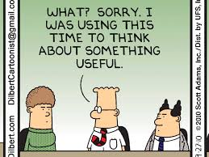
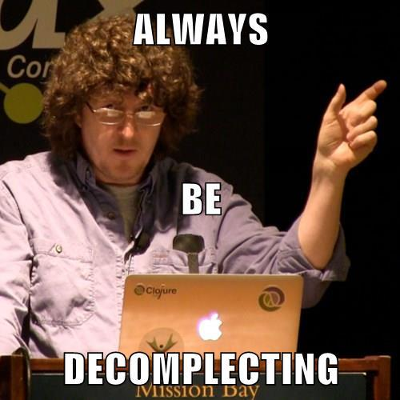

- title : Reducing Developer Friction
- description : A Developer's journey from OO to FP
- author : Reid Evans
- theme : Simple
- transition : Fade

***

's' turns on speaker mode with dual screen

Learning a new paradigm is one of the more difficult things to do in software development. 
So why would an object oriented developer of 10 years suddenly decide to make the drastic switch to functional programming? 
In this talk I’ll show you why I started looking for other ways of writing software and why the switch wasn't as sudden or as drastic as it may seem.

We’ll start our journey with C#, discussing SOLID principals and the use of IoC containers. 
Then we’ll move to JavaScript to see first class functions and closures. 
Next we'll visit the exciting distributed world of Elixir on the Erlang VM. 
We'll finish up with F#, seeing type providers, discriminated unions, and maybe even a certain 5 letter M word.

***
## Reducing Developer Friction

#### A Developer’s Journey from OO to FP

 
 

###[@ReidNEvans](http://twitter.com/reidnevans)

' good morning
' thank you so much for coming today
' This is Reducing Developer Friction 
' A developer’s journey from OO to FP
' I’m Reid Evans and you can find me on Twitter @ReidNEvans
' ... I've been developing software since 95

***

' ...and I’ve been doing it professionally since 04

***

' I’ve worked at companies with 5 employees

***

' I've worked at corporations with thousands of employees 

***

' I’m currently a Senior Developer at The Tombras Group

***

' INSERT TOMBRAS COPY HERE
' ... in preparation for this talk I did ablot of research

***

***

The beginning... 

	procedure TForm1.Button1Click(Sender: TObject);
	begin
		Label1.Caption := 'Hello World';
	end;

#Solid principals

***

### Single Responsibility Principal

A method/class/function should have only one reason to change

***

### Open Closed Principal

Entites should be open for extension but closed for modification

***

### Liskov Substitution Principal

Parent types should be substitutable by their child types

***

### Interface Segregation Principal 

No client should be forced to depend on methods it does not use

***

### Dependency Inversion Principal

High level modules should not depend on low level modules

***

before / after examples leading to ctor + method classes 

***

An object fundamentally has two reasons to change because it contains data and methods

*** 

> "If you have a class with 2 methods and one of them is init, you probably have a function" @jackdied Jack Dietrich

***

First class functions

---

JavaScript

***

Status Quo
http://www.daedtech.com/tag/expert-beginner > @DaedTech

***

> "The model you use to view the world shapes the thoughts you are able to think." @theburningmonk

